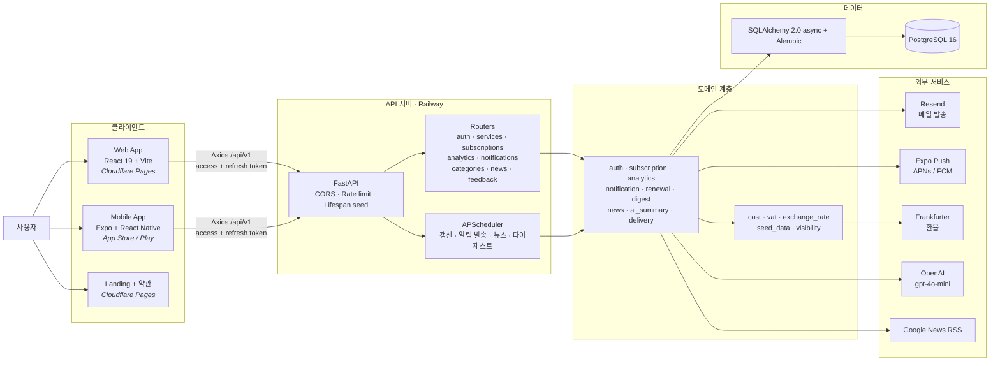

<div align="center">


**흩어진 구독료를 한 곳에 모아, 매달 얼마가 빠져나가는지 보여주는 구독 관리 서비스**

웹 · iOS · Android를 하나의 API로 묶은 풀스택 개인 프로젝트

[](https://app.mysubflow.app)
[](https://mysubflow.app)
[](https://api.mysubflow.app/docs)


</div>

---

## 무엇을 푸는가

구독은 한 번에 하나씩 늘어난다. 넷플릭스 하나, 스포티파이 하나, 어느새 노션과 ChatGPT까지.
그래서 **"내가 지금 구독에 매달 얼마를 쓰고 있지?"** 에 바로 답할 수 있는 사람이 드물다.
결제일은 기억나지 않고, 무료 체험은 조용히 유료로 넘어가고, 해외 서비스는 환율에 부가세까지 붙는다.

SubFlow는 카드사 연동 없이 **사용자가 직접 기록하는 방식**으로 이 문제를 푼다.
금융기관에 연결하지 않으니 민감정보를 다루지 않고, 대신 카탈로그·환율·부가세·알림으로 기록 비용을 최대한 낮췄다.

## 주요 기능

| | 기능 | 설명 |
|:--:|---|---|
| 📚 | **서비스 카탈로그** | 15개 카테고리 · **98종 서비스 · 196개 요금제** 내장. 없는 요금제는 직접 입력 |
| 📊 | **대시보드** | 월/연 총지출, 활성 구독 수, 다가오는 결제, 구독 건강 점수 |
| 📈 | **지출 분석** | 카테고리별 비중, 3/6/12/24개월 추이, 절약 제안, 중복 구독 감지 |
| 📅 | **결제 캘린더** | 과거·미래 결제일을 달력에서 한눈에 |
| 🕐 | **타임라인** | 가입·요금제 변경·일시정지·해지 이력 추적 |
| 💱 | **환율 + 부가세** | 외화 구독을 실시간 환율로 KRW 환산, 표시가에 붙는 부가세 10% 반영 |
| 👥 | **분담 계산** | 가족·팀 공유 구독의 1인당 실부담액 계산 |
| 🔔 | **알림** | 결제 N일 전 알림을 **이메일 + 푸시로 실제 발송**, 주간 다이제스트 |
| 💰 | **예산** | 월 예산 설정 및 초과 경고 |
| 📰 | **뉴스 + AI 요약** | 구독 서비스 관련 뉴스, OpenAI 기반 한 줄 요약 |
| 📤 | **내보내기** | 구독 목록 CSV (UTF-8 BOM, Excel 호환) |
| 🌗 | **기타** | 다크모드, 한/영 다국어, 첫 가입 온보딩, 오류 신고(사진 첨부) |

> 전 기능 무료. 인앱 결제·광고·트래킹 SDK가 없다.

## 아키텍처



## 기술 스택

<table>
<tr><th align="left">Backend</th><th align="left">Web</th><th align="left">Mobile</th></tr>
<tr valign="top"><td>

Python 3.13<br>
FastAPI 0.115<br>
SQLAlchemy 2.0 (async)<br>
Alembic · PostgreSQL 16<br>
Pydantic v2<br>
JWT (python-jose) + bcrypt<br>
slowapi (rate limit)<br>
APScheduler<br>
httpx · aiosmtplib<br>
OpenAI SDK<br>
pytest + pytest-asyncio

</td><td>

React 19 + TypeScript<br>
Vite 8<br>
Zustand<br>
React Router 7<br>
Tailwind CSS 4<br>
Recharts<br>
Axios (JWT 인터셉터)<br>
lucide-react<br>
react-hot-toast<br>
date-fns

</td><td>

Expo SDK 54<br>
React Native 0.81<br>
Expo Router (파일 기반)<br>
Zustand + AsyncStorage<br>
expo-notifications<br>
expo-updates (OTA)<br>
Reanimated 4<br>
react-native-svg<br>
Axios<br>
i18n (한/영)<br>
EAS Build / Submit

</td></tr>
</table>

**인프라** — Railway (API + PostgreSQL) · Cloudflare Pages (웹앱 · 랜딩 · 약관) · Resend (메일, 도쿄 리전) · Docker Compose (로컬 풀스택)

## 시작하기

### 사전 요구사항

Python 3.11+ · Node.js 18+ · Docker Desktop

### 방법 1 — 도커로 한 번에

```bash
cp .env.example .env      # SECRET_KEY 등을 채운다
docker compose up -d --build
```

웹 http://localhost:3000 (nginx가 SPA 서빙 + `/api` → 백엔드 프록시)

### 방법 2 — 로컬 개발

```bash
# 1. DB
docker compose up db -d

# 2. 백엔드
cd backend
python -m venv venv && source venv/bin/activate   # Windows: venv\Scripts\activate
pip install -r requirements.txt
alembic upgrade head
uvicorn app.main:app --reload                     # http://localhost:8000/docs

# 3. 웹
cd frontend && npm install && npm run dev         # http://localhost:5173

# 4. 모바일
cd mobile && npm install && npx expo start        # Expo Go로 QR 스캔
```

서비스 카탈로그(98종/196요금제)는 서버 기동 시 lifespan 훅이 자동으로 시드한다.

### 테스트

```bash
cd backend && pytest        # 14개 파일 / 116개 테스트 — 인증·구독·분석·갱신·부가세·알림
```

테스트는 `subscription_test_db`를 따로 만들어 쓴다. `.env`에서 `DB_PORT`나
`POSTGRES_PASSWORD`를 기본값에서 바꿨다면 `DATABASE_URL`과 `TEST_DATABASE_URL`을
함께 넘겨야 한다 — 둘 중 하나만 넘기면 테스트 DB 생성 단계에서 막힌다.

## 배포

| 대상 | 위치 | 명령 |
|---|---|---|
| API | Railway → `api.mysubflow.app` | `railway up` (깃 연동 아님, 수동 배포) |
| 웹앱 | Cloudflare Pages → `app.mysubflow.app` | `cd frontend && npm run build` 후 업로드 |
| 랜딩·약관 | Cloudflare Pages → `mysubflow.app` | `landing/`, `legal/` 정적 배포 |
| iOS/Android | EAS Build → App Store / Play | `npx eas-cli build -p ios --profile production`<br>`npx eas-cli submit -p ios --latest` |

빌드 번호는 `eas.json`의 `appVersionSource: remote` + `autoIncrement`로 EAS가 관리한다 — `app.json`에서 직접 올리지 않는다.

## 프로젝트 구조

```
SubFlow/
├── backend/                   # FastAPI
│   ├── app/
│   │   ├── main.py            # 앱 진입점 · CORS · lifespan 시드 · 스케줄러
│   │   ├── config.py          # pydantic-settings 환경 설정
│   │   ├── scheduler.py       # APScheduler 잡 정의
│   │   ├── core/              # security(JWT/bcrypt), deps(DB 세션·현재 유저)
│   │   ├── models/            # SQLAlchemy ORM 11종
│   │   ├── schemas/           # Pydantic 요청/응답
│   │   ├── routers/           # auth · services · subscriptions · analytics
│   │   │                      # notifications · categories · news · feedback
│   │   ├── services/          # 비즈니스 로직 (analytics, renewal, digest, delivery …)
│   │   ├── utils/             # cost · vat · exchange_rate · seed_data · visibility
│   │   ├── messages.py        # 사용자 노출 문구 단일 소스 (메일·푸시·알림)
│   │   └── tests/             # pytest 14 파일
│   └── alembic/versions/      # 마이그레이션 21개
├── frontend/                  # React 19 + Vite 웹앱
│   └── src/{api,store,pages,components,hooks,types}
├── mobile/                    # Expo + React Native
│   ├── app/{(auth),(tabs)}    # Expo Router — 로그인/가입 · 6개 탭
│   └── src/{components,constants,hooks,i18n,services,store,types}
├── landing/                   # 랜딩 페이지 (정적)
├── legal/                     # 이용약관 · 개인정보처리방침
├── brand/                     # 로고·마크 에셋
├── app_icons/                 # iOS AppIcon.appiconset · Android mipmap
└── docker-compose.yml         # db + backend + web(nginx)
```

## API

모든 엔드포인트는 `/api/v1` 프리픽스를 쓴다. 전체 명세는 [Swagger](https://api.mysubflow.app/docs)에서 확인할 수 있다.

| 그룹 | 주요 엔드포인트 |
|---|---|
| **Auth** | `POST /auth/register` · `/login` · `/refresh` · `/verify-email` · `/forgot-password` · `/reset-password`<br>`GET·PUT·DELETE /auth/me` |
| **Services** | `GET /services` · `/services/popular` · `/services/search` · `/services/{id}/price-history` |
| **Subscriptions** | `GET·POST /subscriptions` · `POST /subscriptions/from-catalog` · `GET /subscriptions/export`<br>`/upcoming` · `/calendar-events` · `/timeline` · `/trials` · `/{id}/history` |
| **Analytics** | `/analytics/overview` · `/spending-trend` · `/category-breakdown` · `/overlaps`<br>`/savings-suggestions` · `/budget-status` · `/price-changes` · `/exchange-rate-alerts` |
| **Notifications** | `GET·PUT /notifications/settings` · `/inbox` · `PUT /push-token` · `POST /deliver` · `/digest` |
| **News** | `GET /news` · `POST /news/summary` |
| **Feedback** | `POST /feedback/contact` (오류 신고 · 사진 첨부) |

## 데이터 모델

```mermaid
erDiagram
    USERS ||--o{ SUBSCRIPTIONS : owns
    USERS ||--|| NOTIFICATION_SETTINGS : configures
    USERS ||--o{ PAYMENT_HISTORY : records
    USERS ||--o{ SUBSCRIPTION_HISTORY : records
    USERS ||--o{ NOTIFICATIONS : receives
    CATEGORIES ||--o{ SUBSCRIPTIONS : groups
    CATEGORIES ||--o{ SERVICES : classifies
    SERVICES ||--o{ SERVICE_PLANS : offers
    SERVICES ||--o{ SUBSCRIPTIONS : sourced_from
    SERVICE_PLANS ||--o{ SUBSCRIPTIONS : selected_as
    SERVICE_PLANS ||--o{ PLAN_PRICE_HISTORY : tracks
    SUBSCRIPTIONS ||--o{ PAYMENT_HISTORY : generates
    SUBSCRIPTIONS ||--o{ SUBSCRIPTION_HISTORY : changes

    USERS {
        uuid id PK
        string email UK
        string username
        boolean is_active
        boolean email_verified
    }
    SUBSCRIPTIONS {
        uuid id PK
        uuid user_id FK
        int category_id FK
        int service_id FK
        int plan_id FK
        string service_name
        numeric cost
        string currency
        enum billing_cycle
        enum status
        int member_count
        date next_billing_date
    }
    SERVICES {
        int id PK
        int category_id FK
        string name UK
        string logo_url
        string cancel_url
        boolean is_popular
    }
    SERVICE_PLANS {
        int id PK
        int service_id FK
        string name
        numeric price
        string currency
        enum billing_cycle
        boolean is_active
    }
    CATEGORIES {
        int id PK
        string name UK
        string icon
        string color
    }
    NOTIFICATION_SETTINGS {
        uuid id PK
        uuid user_id FK
        int notify_days_before
        boolean email_notifications
        boolean push_notifications
        string push_token
        int budget_monthly
    }
    PAYMENT_HISTORY {
        uuid id PK
        uuid subscription_id FK
        uuid user_id FK
        numeric amount
        string currency
        date paid_at
    }
    SUBSCRIPTION_HISTORY {
        uuid id PK
        uuid subscription_id FK
        uuid user_id FK
        string event_type
        string description
    }
    PLAN_PRICE_HISTORY {
        int id PK
        int plan_id FK
        numeric price
        string currency
        date effective_date
    }
    NOTIFICATIONS {
        uuid id PK
        uuid user_id FK
        string type
        string title
        string body
        string link
    }
    NEWS_CACHE {
        int id PK
        string title
        string link UK
        string source
        string category
        datetime fetched_at
    }
```

<details>
<summary>ER 다이어그램 (테이블 11개)</summary>



</details>

| 테이블 | 역할 |
|---|---|
| `users` | 계정 (UUID · email · 해시 비밀번호 · 인증 여부) |
| `categories` | 서비스 카테고리 15종 |
| `services` / `service_plans` | 카탈로그 98종 / 요금제 196개 |
| `plan_price_history` | 요금제 인상·인하 이력 |
| `subscriptions` | 사용자 구독 (active / paused / cancelled / trial) |
| `payment_history` | 자동 갱신 시 기록되는 결제 이력 |
| `subscription_history` | 가입·변경·해지 이벤트 |
| `notification_settings` / `notifications` | 알림 설정과 발송 레코드 |
| `news_cache` | 뉴스 캐시 (link 기준 dedup, 6시간 갱신) |

## 백그라운드 작업

APScheduler가 API 프로세스 안에서 함께 돈다 (`app/scheduler.py`, 시간대 UTC).

| 주기 | 작업 |
|---|---|
| 매일 00:10 | 지난 결제일 구독을 주기만큼 자동 전진 (말일 보정) + 경과 주기마다 결제 이력 기록 |
| 10분마다 | 대기 중인 알림을 이메일·푸시로 발송 |
| 6시간마다 | 뉴스 캐시 갱신 + AI 요약 생성 |
| 월요일 00:00 | 주간 지출 다이제스트 메일 |

갱신·뉴스 작업은 기동 직후 1회도 함께 실행된다.

## 보안

- **인증** — JWT access(30분) + refresh(60일), bcrypt 해싱, 이메일 인증 및 비밀번호 재설정 토큰
- **비밀번호 정책** — 최소 8자 + 영문 + 숫자
- **Rate limiting** — 로그인 10회/분, 회원가입 5회/분 (slowapi)
- **사용자 열거 방지** — 로그인 실패 응답 401 통일 + 타이밍 완화
- **시크릿 분리** — `SECRET_KEY`·DB 비밀번호 환경변수화, 기본값 사용 시 기동 경고
- **프록시 스푸핑 대비** — `X-Forwarded-For` 신뢰를 `TRUST_PROXY` 플래그로 제어 (기본 off)
- **금융정보 미취급** — 카드·계좌·PG 연동 없음. 모든 금액은 사용자가 직접 입력한 숫자

## 환경 변수

`.env.example`을 복사해서 쓴다. 주요 항목만:

| 변수 | 기본값 | 설명 |
|---|---|---|
| `SECRET_KEY` | (개발용) | JWT 서명 키 — **운영에서 반드시 교체** |
| `DATABASE_URL` | localhost | `postgresql+asyncpg://…` |
| `ALLOWED_ORIGINS` | localhost | CORS 허용 도메인 (콤마 구분) |
| `OPENAI_API_KEY` | (빈값) | 설정 시 뉴스 AI 요약 활성화, 미설정 시 원문 폴백 |
| `SMTP_HOST` `SMTP_PORT` `SMTP_USER` `SMTP_PASSWORD` `SMTP_FROM` | — | 메일 발송 (운영은 Resend SMTP). 미설정 시 no-op |
| `TRUST_PROXY` | `false` | 리버스 프록시 뒤 배포 시 `true` |
| `WEB_PORT` | `3000` | 도커 nginx 노출 포트 |

⚠️ PowerShell에서 `Set-Content`로 `.env`를 고치면 BOM이 붙어 첫 줄 키가 깨진다. `-Encoding utf8NoBOM`을 쓰거나 에디터로 편집할 것.

## 로드맵

- [x] 웹앱 배포 (Cloudflare Pages)
- [x] API 배포 (Railway) + 커스텀 도메인
- [x] iOS 빌드 · App Store 제출
- [ ] iOS 심사 통과 후 출시
- [ ] Android — Play Console 등록 및 출시
- [ ] 소셜 로그인 (Google / Kakao) — 각 개발자 앱 자격증명 발급 후

## 라이선스

[All rights reserved](LICENSE). 학습·참고 목적의 코드 열람은 자유롭지만, 복제·배포·상업적 이용은 허용하지 않는다.

## 문의

[mysubflow.app](https://mysubflow.app)
<br>
[yge0307@gmail.com](mailto:yge0307@gmail.com) · [hyebing883@gmail.com](mailto:hyebing883@gmail.com)
</content>
</invoke>
